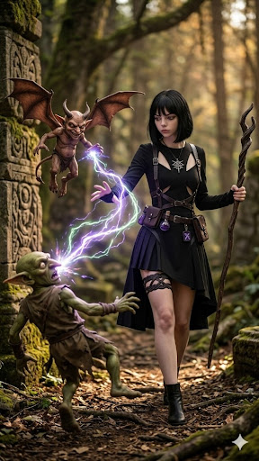

# D&D 2024 Character Sheet - Level 1 (Brenya)

**Name:** Brenya
**Species:** Human (2024)
**Class & Level:** Warlock 1
**Background:** Wayfarer (Customized for +2 Cha, +1 Dex)
**Alignment:** Neutral
**Patron:** The Fiend

---
## Core Stats
**Armor Class (AC):** 13 (Leather Armor + 2 Dex)
**Hit Points (HP):** 11 (8 + 2 Con + 1 from Human/Tough feat)
**Hit Dice:** 1d8
**Speed:** 30 ft.
**Proficiency Bonus:** +2

---
## Ability Scores & Saving Throws (2024)
| Stat | Score | Mod | Saving Throw |
|---|---|---|---|
| **STR** | 8 | -1 | -1 |
| **DEX** | 14 | +2 | +2 |
| **CON** | 14 | +2 | +2 |
| **INT** | 10 | +0 | +0 |
| **WIS** | 10 | +0 | **+2 (Proficient)** |
| **CHA** | 18 | +4 | **+6 (Proficient)** |

---
## Skills & Tools
*   **Insight (Wis): +2** (Warlock)
*   **Intimidation (Cha): +6** (Warlock)
*   **Sleight of Hand (Dex): +4** (Background)
*   **Stealth (Dex): +4** (Background)
*   **Investigation (Int): +2** (Human)
*   **Thieves' Tools: +4** (Background)

---
## Combat (2024 Rules)
**Initiative:** +2

**Attacks:**
*   **Eldritch Blast:** +6 to hit, Range 120 ft., Damage 1d10 + 4 Force. (Note: In 2024, Agonizing Blast is an Invocation you can take at Level 1!)
*   **Xil (Imp) Attack:** Xil can attack as part of your action/bonus action depending on your Invocations.

---
## Features & Traits (2024)

**Pact Spells (The Fiend):**
You always have *Burning Hands* and *Command* prepared.

**Dark One's Blessing:**
When you reduce a creature to 0 HP, you gain 5 Temporary HP.

**Eldritch Invocations (Level 1):**
In 2024, Warlocks get two Invocations at Level 1!
1.  **Agonizing Blast:** Add your Charisma modifier (+4) to the damage of *Eldritch Blast*.
2.  **Pact of the Chain:** You can cast *Find Familiar* as a ritual. **Xil manifests physically at Level 1.** He has the enhanced 2024 familiar stats.

**Origin Feats (Human & Background):**
1.  **Lucky:** You have 2 Luck Points to gain Advantage or give Disadvantage.
2.  **Tough:** Your HP maximum increases by 2 per level (Already included in HP total).

---
## Spellcasting
**Spellcasting Ability:** Charisma (Save DC: 14, Attack Bonus: +6)
**Warlock Slots:** 1 (Level 1, refreshes on Short Rest)

**Cantrips:**
*   *Eldritch Blast*
*   *Friends* (2024 version is much safer to use)
*   *Minor Illusion* (Human Species trait)

**Prepared Spells:**
1.  *Armor of Agathys*
2.  *Hellish Rebuke*
3.  *Burning Hands* (Patron Spell)
4.  *Command* (Patron Spell)
